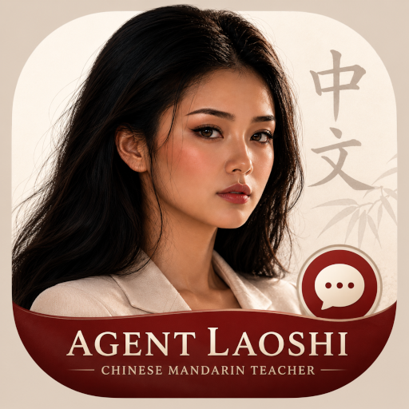
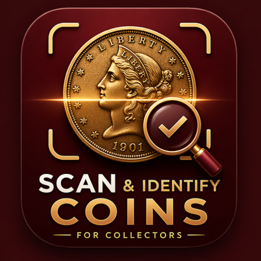

# Carlier's AI Mobile Apps

**AI-powered mobile apps for language learning and collectibles**

Founder & Developer: [Carlier](https://carlier.site)

---

## Language Learning Apps

### AI Agent Laoshi - Learn Chinese Mandarin

A live AI Mandarin teacher that helps you learn to speak, practice, and translate Chinese Mandarin in real time with voice and vision.

**Features:**
- Natural voice conversations with AI
- Camera context for object learning
- Real-time pronunciation and grammar corrections
- Instant translation for phrases and dialogue

[View Landing Page](https://carlier.site/learn-chinese/)

---

### AI Agent Lousi - Learn Cantonese

A live AI Cantonese teacher that helps you learn to speak, practice, and translate Chinese Cantonese in real time with voice and vision.

**Features:**
- Natural voice conversations with AI
- Camera context for object learning
- Real-time pronunciation and grammar corrections
- Instant translation for phrases and dialogue

[View Landing Page](https://carlier.site/learn-cantonese/)

---

### AI Agent Khru - Learn Thai

A live AI Thai teacher that helps you learn to speak, practice, and translate Thai in real time with voice and vision.

**Features:**
- Natural voice conversations with AI
- Camera context for object learning
- Real-time pronunciation and grammar corrections
- Instant translation for phrases and dialogue

[View Landing Page](https://carlier.site/learn-thai/)

---

### AI Agent Vchytel - Learn Ukrainian

A live AI Ukrainian teacher that helps you learn to speak, practice, and translate Ukrainian in real time with voice and vision.

**Features:**
- Natural voice conversations with AI
- Camera context for object learning
- Real-time pronunciation and grammar corrections
- Instant translation for phrases and dialogue

> **Note:** Coming soon to Google Play

[View Landing Page](https://carlier.site/learn-ukrainian/)

---

## Collectors Apps

### Coin Identifier

An AI-powered coin scanner app for collectors and numismatists. Instantly identify coins, estimate market values, check rarity, and catalog your collection with historical insights.

**Features:**
- AI-powered coin recognition and identification
- Market value estimation
- Collection cataloging
- Historical coin details
- Camera scanner with focus controls

[View Landing Page](https://carlier.site/coinidentifier/)

---

## About the Developer

Hi, I'm **Carlier** - a founder and software engineer passionate about creating impactful AI-powered products. With expertise spanning mobile development, SaaS, AI systems, and systems architecture, I build apps that help people learn languages and explore their passions.

- **Website:** [carlier.site](https://carlier.site)
- **GitHub:** [github.com/yanncarlier](https://github.com/yanncarlier)
- **LinkedIn:** [linkedin.com/in/yanncarlier](https://www.linkedin.com/in/yanncarlier/)
- **Email:** hello@carlier.site

---

## Tech Stack

These apps are built using:

- **Framework:** Flutter (Dart)
- **AI Engine:** Gemini Live API
- **Backend:** Node.js, Python
- **Cloud:** AWS, Google Cloud
- **CI/CD:** GitHub Actions

---

## Support

For feedback, bug reports, or feature requests, please reach out via:

- Email: [hello@carlier.site](mailto:hello@carlier.site)
- GitHub Issues: Open an issue on the respective repository

---

&copy; 2026 Carlier. All rights reserved.

